# VIPER - Viral Identification Pipeline for Emergency Response

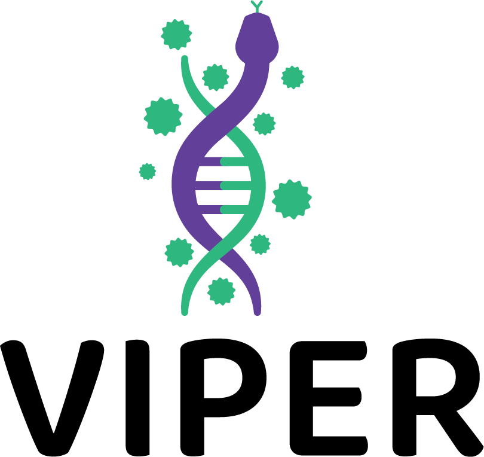

[Read in English](README.md)

VIPER é uma ferramenta para montagem e identificação de genomas virais (SARS-CoV-2, Dengue e Influenza) a partir de dados Illumina. Desenvolvida pela equipe de bioinformática do [CeVIVAS](https://cevivas.butantan.gov.br/) (Instituto Butantan), combina uma GUI no Windows com pipelines robustos em linha de comando para Linux.

## Índice

- [VIPER - Viral Identification Pipeline for Emergency Response](#viper---viral-identification-pipeline-for-emergency-response)
  - [Índice](#índice)
  - [Destaques](#destaques)
  - [Pipelines suportados](#pipelines-suportados)
  - [Instalação](#instalação)
    - [Windows (GUI)](#windows-gui)
    - [Linux (linha de comando, sem GUI)](#linux-linha-de-comando-sem-gui)
  - [Uso](#uso)
    - [Windows GUI (uso)](#windows-gui-uso)
    - [Linux (linha de comando)](#linux-linha-de-comando)
  - [Visão geral das pipelines](#visão-geral-das-pipelines)
  - [Implementações futuras](#implementações-futuras)
  - [Direitos autorais e licença](#direitos-autorais-e-licença)

## Destaques

- Pipelines multivírus com referências curadas e atribuição de linhagem.
- GUI no Windows para usuários sem experiência técnica; linha de comando no Linux para servidores e pipelines.
- Execução consciente de recursos: testado em cenários com poucos recursos computacionais.
- Projeto aberto e personalizável para rotinas de vigilância e laboratório.

## Pipelines suportados

- Montagem de SARS-CoV-2 (Illumina)
- Montagem de Dengue (Illumina)
- Montagem de Influenza (Illumina)

## Instalação

### Windows (GUI)

- Baixe o instalador para Windows (`.exe`) em [Releases](../../releases). O instalador configura a GUI e o backend em WSL.
- Requisitos: Windows 10 2004+ (build 19041+) ou Windows 11, permissão de administrador e ~10 GB livres. Conexão à internet necessária para baixar dependências.
- Antivírus podem sinalizar o instalador; se ocorrer, adicione VIPER à lista de permissões.

**Passo a passo com imagens**

1) Escolha tarefas opcionais (atalho na área de trabalho).  
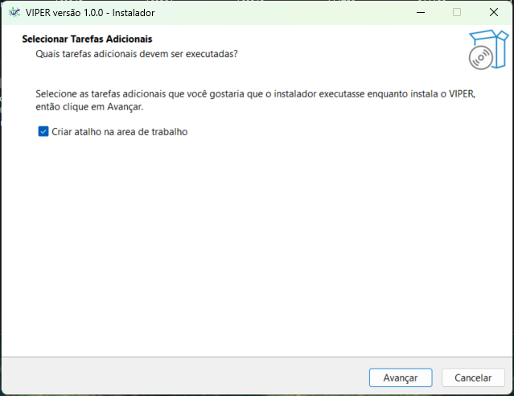

2) Confirme a instalação.  
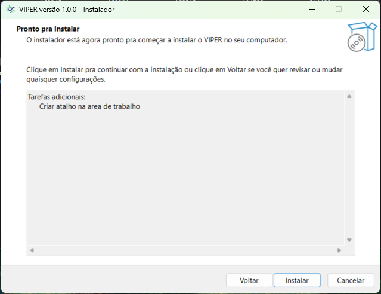

3) Cópia de arquivos.  
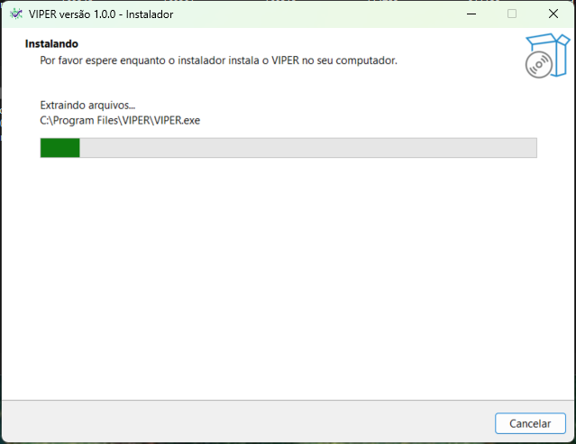

4) Bootstrap do core/WSL.  
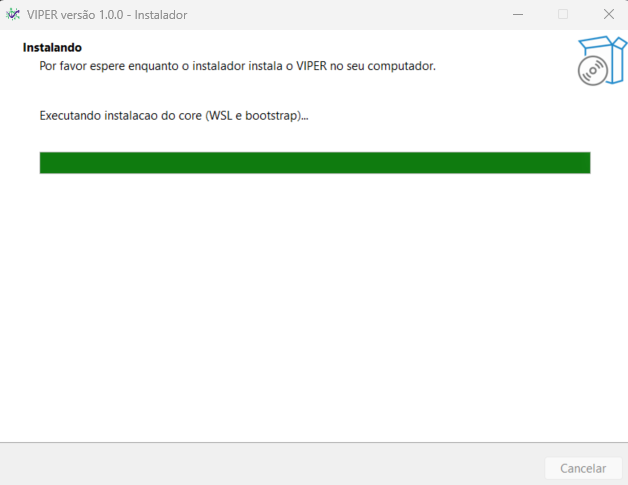

5) Autorize a habilitação do WSL se solicitado.  
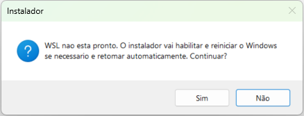

6) Windows habilitando o WSL.  
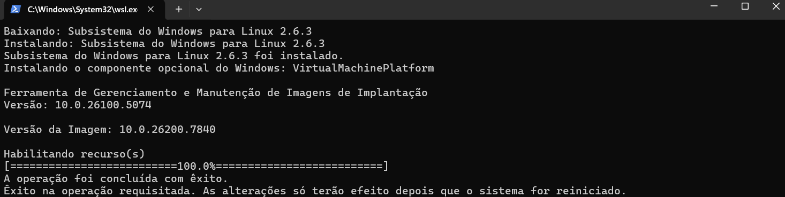

7) Bootstrap dentro do WSL (micromamba + ambiente).  
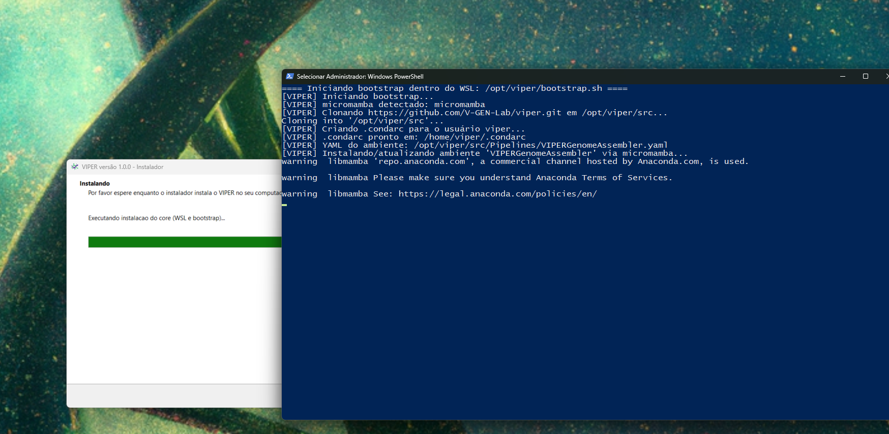

8) Instalação dos pacotes.  
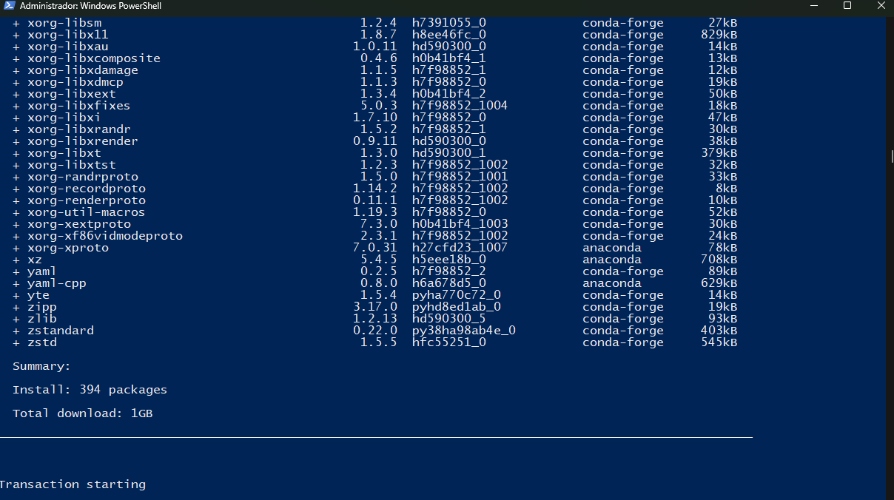

9) Finalização de links e PATH no WSL.  
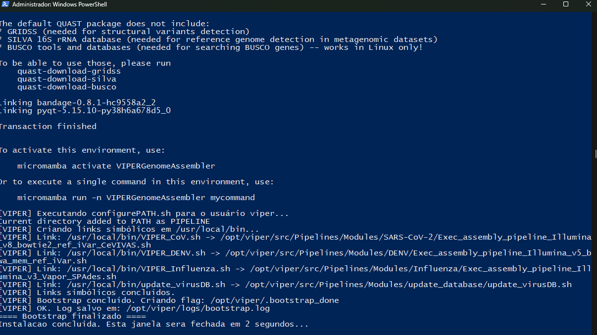

10) Conclusão do instalador.  
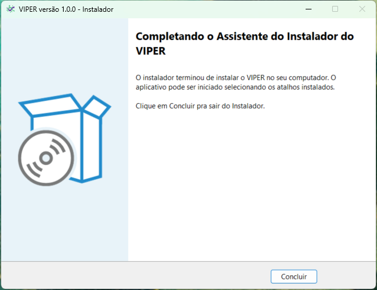

Após instalar, abra o VIPER pelo menu Iniciar ou execute `VIPER.exe` na pasta de instalação. Para remover, use “Aplicativos e Recursos” e, se necessário, execute `wsl --unregister VIPER-Core` em um PowerShell elevado.

### Linux (linha de comando, sem GUI)

No Linux o uso é apenas via terminal.

**Pré-requisitos**

- Bash, git, curl e `sudo` (para links opcionais).
- Micromamba ou Conda (micromamba recomendado).
- Python 3.8 (gerenciado pelo YAML do ambiente).

**1) Obtenha o código**

```bash
git clone https://github.com/V-GEN-Lab/viper.git
cd viper
```

**2) Instale micromamba (caso não tenha micromamba/conda)**  
Exemplo para bash:

```bash
curl -Ls https://micro.mamba.pm/api/micromamba/linux-64/latest | tar -xvj bin/micromamba
./bin/micromamba shell init -s bash -p ~/.local/share/micromamba
source ~/.bashrc
```

**3) Crie o ambiente do VIPER**

O YAML fixa todas as dependências e define o prefixo `~/.local/share/mamba/envs/VIPERGenomeAssembler`.

```bash
micromamba create -y -f Pipelines/VIPERGenomeAssembler.yaml
micromamba activate VIPERGenomeAssembler
# Se a ativação por nome falhar, use o caminho:
# micromamba activate ~/.local/share/mamba/envs/VIPERGenomeAssembler
```

**4) Disponibilize os scripts do pipeline**

Opção A (recomendada, cria wrappers `/usr/local/bin/VIPER_*.sh`):

```bash
sudo bash update.d/post-update.sh
```

Opção B (sem sudo): adicione a pasta de módulos ao PATH e exponha `$PIPELINE`:

```bash
cd Pipelines/Modules
chmod +x configurePATH.sh
./configurePATH.sh
# Reabra o shell ou rode source ~/.bashrc para carregar PATH/PIPELINE.
```

## Uso

### Windows GUI (uso)

Abra `VIPER.exe`. A interface tem modo básico e avançado:

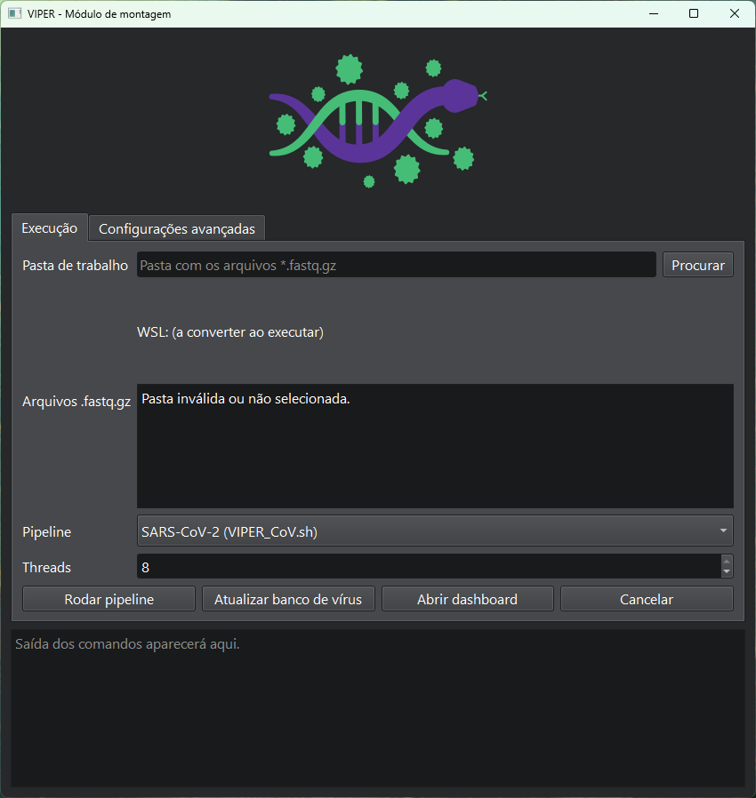  
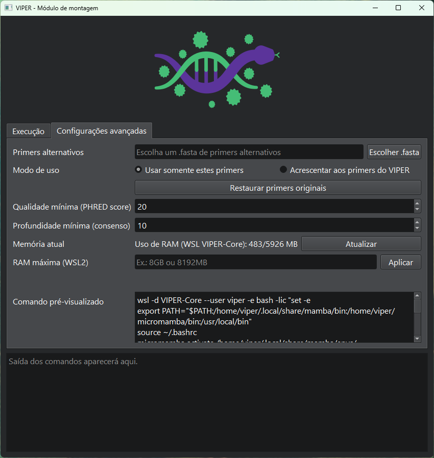

Na aba Avançado, você pode alterar a RAM máxima que o VIPER pode usar: digite o valor no formato exigido, clique em Aplicar e use o botão de Atualizar para confirmar que funcionou.

O VIPER atualiza as bases virais antes de cada execução; você também pode atualizar manualmente quando necessário.

Defina quantas threads o VIPER usará na montagem antes de iniciar a análise.

Fluxo para rodar o pipeline:

⚠️ Garanta que seus arquivos FASTQ sigam a convenção de nomenclatura da Illumina usada no BaseSpace: [guia de nomenclatura da Illumina](https://support.illumina.com/help/BaseSpace_Sequence_Hub_OLH_009008_2/Source/Informatics/BS/NamingConvention_FASTQ-files-swBS.htm)

1) Selecione a pasta com os pares `*.fastq.gz`.  
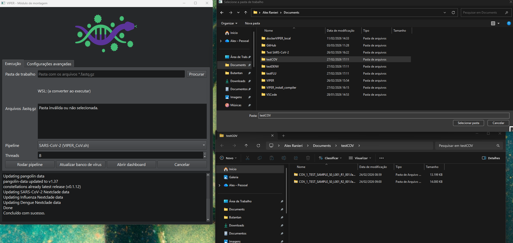  

1.1) Escolha o pipeline viral.  
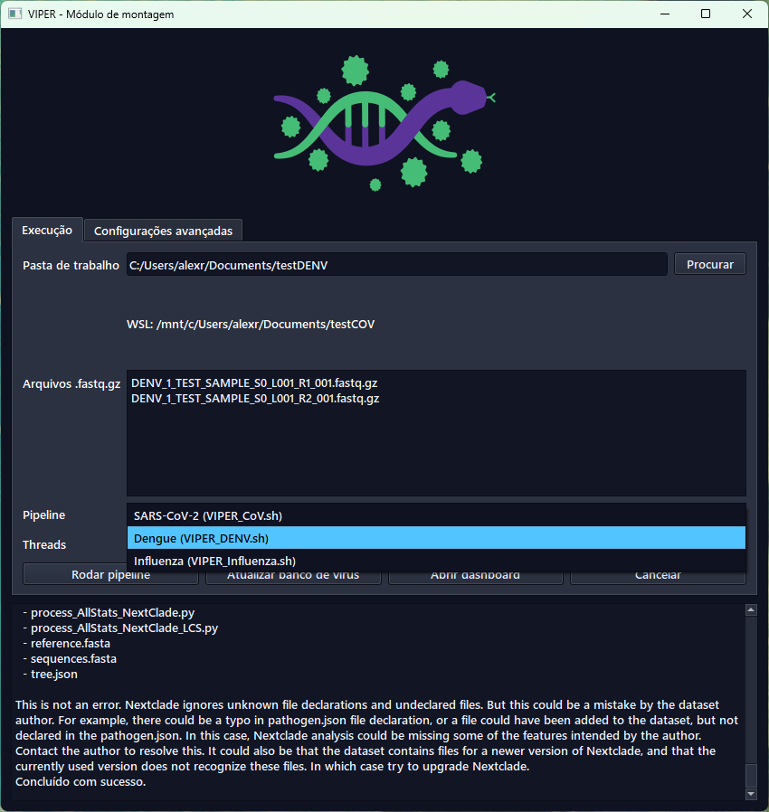

1) Depois de escolher pasta e pipeline, revise e continue.  
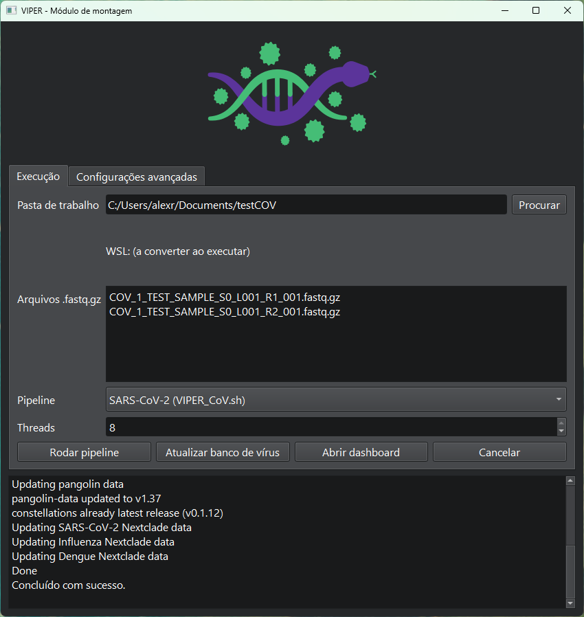

1) Execução concluída com sucesso; mensagem de confirmação exibida.  
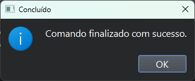

1) Escolha se deseja abrir um dashboard simplificado para visualizar os resultados.  


1) Dashboard; exporte resultados em Excel, se quiser.  
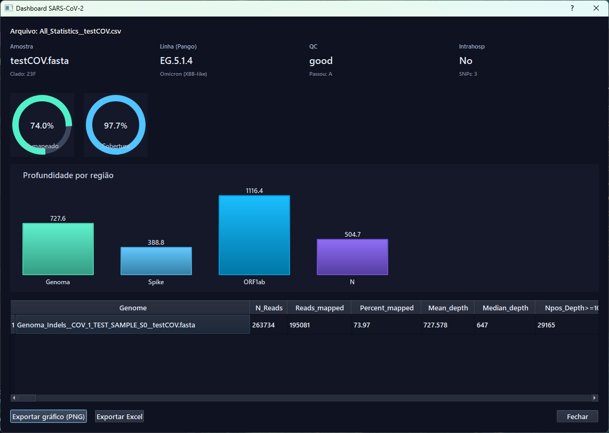

1) Arquivos gerados na pasta do pipeline (.fasta e subpastas por amostra com arquivos adicionais).  
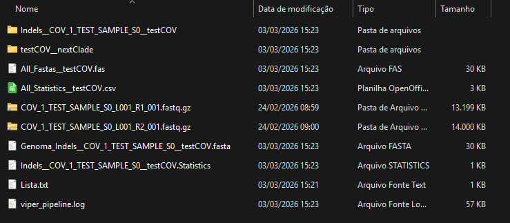

Atualização manual de bases (opcional):  
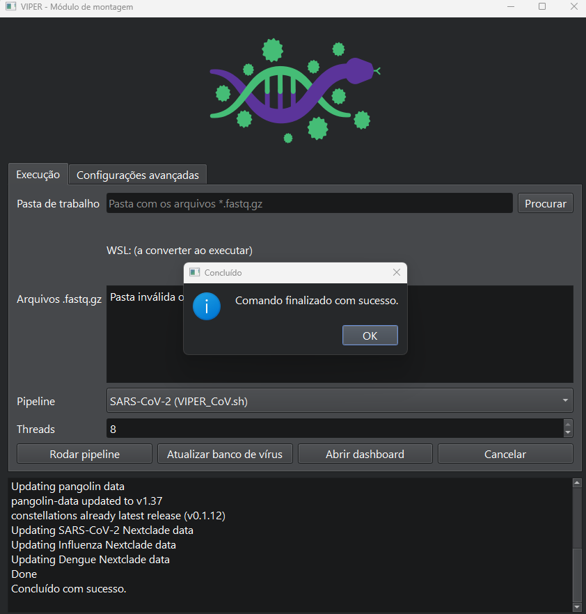

### Linux (linha de comando)

Ative o ambiente primeiro:

```bash
micromamba activate VIPERGenomeAssembler
```

Se você executou `update.d/post-update.sh`, use os wrappers:

```bash
# {threads} = threads por amostra, {samples} = amostras em paralelo
VIPER_CoV.sh {threads} {samples}       # SARS-CoV-2
VIPER_DENV.sh {threads} {samples}      # Dengue
VIPER_FLU.sh {threads} {samples}       # Influenza
```

Se usou apenas `configurePATH.sh`, rode via `$PIPELINE`:

```bash
bash "$PIPELINE/SARS-CoV-2/Exec_assembly_pipeline_Illumina_v8_bowtie2_ref_iVar_CeVIVAS.sh" {threads} {samples}
bash "$PIPELINE/DENV/Exec_assembly_pipeline_Illumina_v5_bwa_mem_ref_iVar.sh" {threads} {samples}
bash "$PIPELINE/Influenza/Exec_assembly_pipeline_Illumina_v3_Vapor_SPAdes.sh" {threads} {samples}
```

Resultados são gravados na mesma pasta das FASTQ. Amostras de teste estão em `Test_samples/`.

## Visão geral das pipelines

**Visão geral: montagem de SARS-CoV-2**  


**Visão geral: montagem de Dengue**  
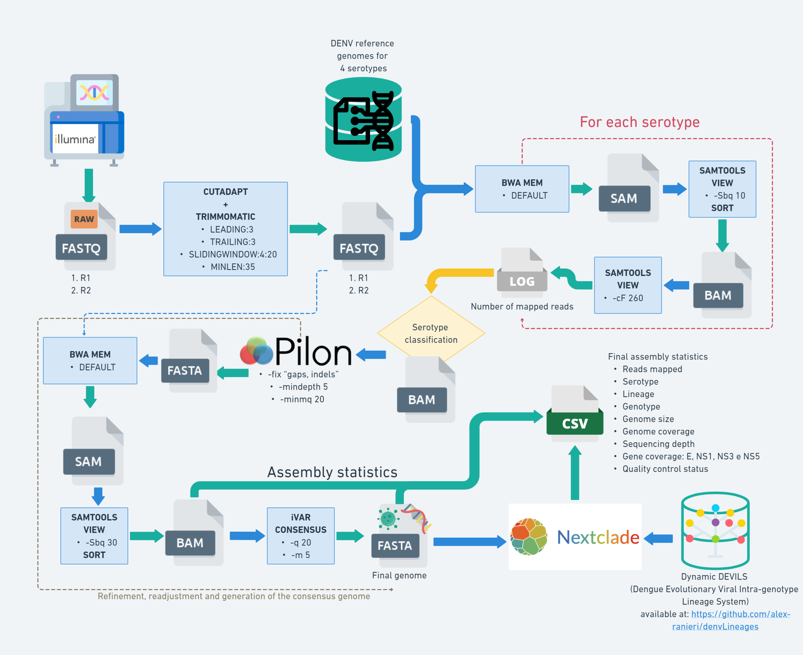

**Visão geral: montagem de Influenza**  


## Implementações futuras

- Pipelines para outros vírus (ex.: Chikungunya, RSV).
- Detecção automática do tipo de vírus analisado.
- Módulo de filogenia com visualização interativa de árvore via Auspice.
- Reformulação dos módulos de montagem para detecção de iSNVs.
- Permitir que o usuário insira sua própria sequência de referência para montagem.
- Otimização do pipeline para gerenciadores de workflow (ex.: Snakemake, Nextflow).

## Direitos autorais e licença

VIPER foi criado pela equipe de bioinformática do [CeVIVAS](https://cevivas.butantan.gov.br/) do Instituto Butantan:

- Alex Ranieri J. Lima
- Gabriela Ribeiro
- Vinicius Carius De Souza
- Isabela Carvalho Brcko
- Igor Santana Ribeiro
- James Siqueira Pereira
- Vincent Louis Viala

Supervisão:

- Maria Carolina Quartim Barbosa Elias Sabbaga
- Sandra Coccuzzo Sampaio

VIPER é software livre; você pode redistribuí-lo e/ou modificá-lo sob os termos da GNU General Public License publicada pela Free Software Foundation, versão 3 ou posterior.

VIPER é distribuído na esperança de ser útil, mas **sem qualquer garantia; sem mesmo a garantia implícita de comerciabilidade ou adequação a um propósito específico**. Veja a GNU General Public License para mais detalhes: http://www.gnu.org/licenses/.
